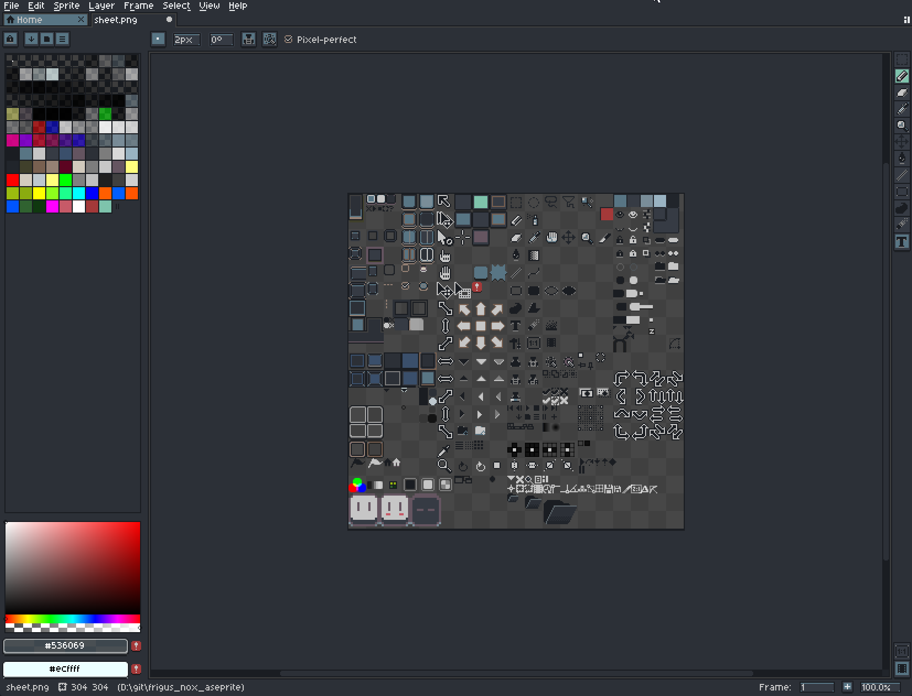

# Frigus Nox — Aseprite Theme

Aseprite theme matching the [Frigus Nox Neovim colorscheme](https://github.com/Furash/frigus_nox_nvim).

## Install

### Option A — Drop into Aseprite extensions folder

1. Locate Aseprite's user data folder:
   - Windows: `%AppData%\Aseprite\extensions\`
   - macOS: `~/Library/Application Support/Aseprite/extensions/`
   - Linux: `~/.config/aseprite/extensions/`
2. Copy this folder into it as `frigus-nox/`.
3. Restart Aseprite.
4. `Edit → Preferences → Theme → Frigus Nox → Select → Apply`.

### Option B — Install the released `.aseprite-extension`

Grab the latest `.aseprite-extension` from the [Releases page](https://github.com/Furash/frigus_nox_aseprite/releases) and double-click it (or *Edit → Preferences → Extensions → Add Extension*).

## Files

- `package.json` — Aseprite extension manifest
- `theme.xml`    — colors, dimensions, parts, styles (forked from Aseprite default-dark)
- `sheet.png`    — UI sprite atlas, palette-remapped to Frigus Nox tones
- `sheet.aseprite-data` — slice metadata for the atlas

## Credits

- Sprite atlas + structural XML: forked from Aseprite default theme by David Capello, Ilija Melentijevic, Nicolas Desilets — CC-BY-4.0
